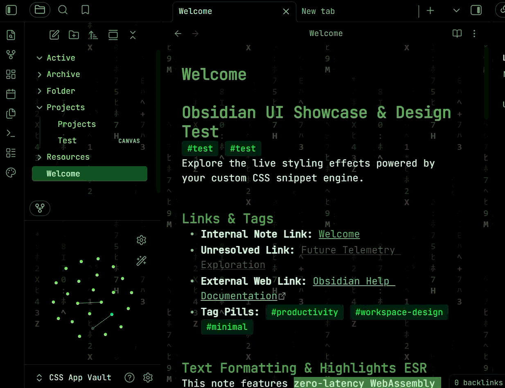
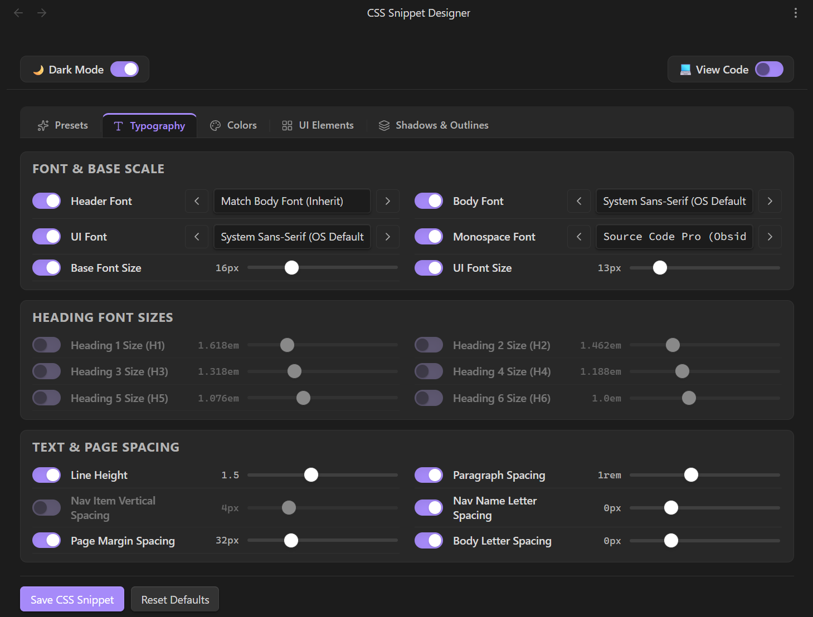
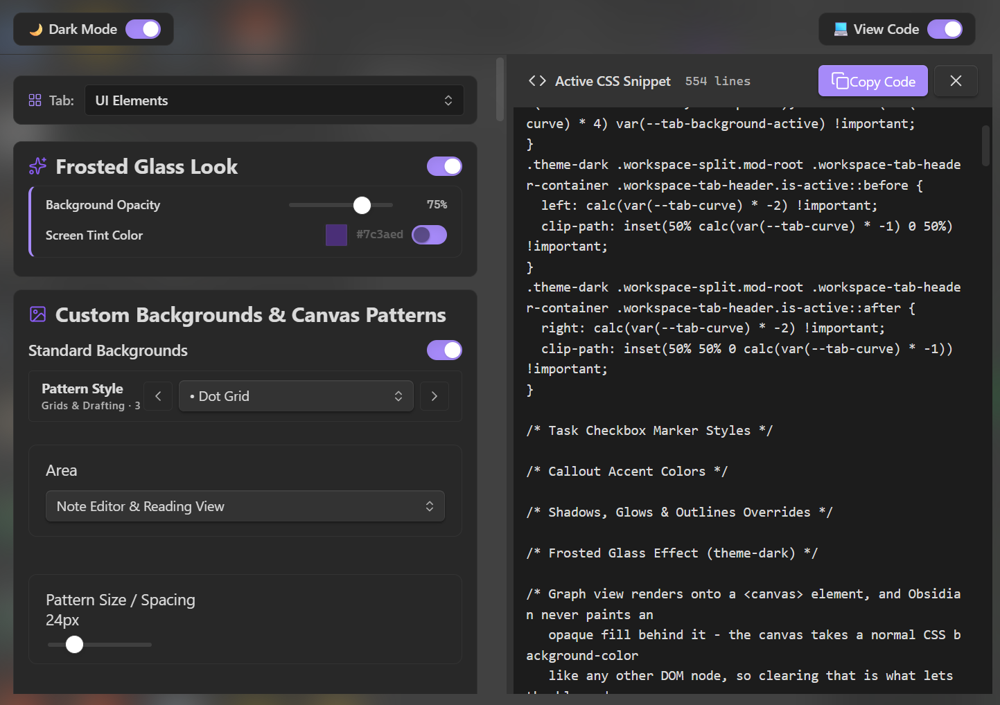

# CSS Snippet Designer



A visual styling studio for [Obsidian](https://obsidian.md). Tune typography, colors, shadows, backgrounds and UI elements with live controls, then save the result as a standard CSS snippet.

> **Desktop only** — requires Obsidian 1.7.2 or newer.

[](https://github.com/JeffJBerry/obsidian-css-snippet-designer/actions/workflows/lint.yml)
[](https://github.com/JeffJBerry/obsidian-css-snippet-designer/blob/main/LICENSE)
[](https://github.com/JeffJBerry/obsidian-css-snippet-designer/releases)

## Features

- Live preview across both Reading View and Live Preview
- Generates plain CSS in real time, ready to copy and share
- Curated presets and procedural background patterns
- Shadows, glows and animations, with reduced-motion support
- Fenced output that preserves your own CSS between saves
- Built-in structural CSS validation before anything is written

## The designer



Switch between **Presets**, **Typography**, **Colors**, **UI Elements**, and **Shadows & Outlines**; every control updates the live preview and the generated snippet in real time.

## Live CSS generation



Every control change updates the Obsidian UI instantly and writes the matching plain CSS in real time. The live snippet appears in a code pane with a **Copy Code** button, so you can copy and share your CSS just like any other snippet.

## Installation

Copy `main.js`, `manifest.json`, and `styles.css` into `.obsidian/plugins/css-snippet-designer/` inside your vault, then reload Obsidian and enable **CSS Snippet Designer** under **Settings → Community plugins**.

## Development

```bash
npm install
npm run dev      # esbuild watch
npm run check    # typecheck + lint + tests + smoke load
npm run build    # production bundle
```

Pure TypeScript with no runtime dependencies. All CSS is produced by pure generator functions and validated before it reaches disk. The suite covers 288 tests running on Node's built-in test runner.

## AI disclosure

This plugin was developed with the assistance of AI coding tools. All code is reviewed, tested, and maintained by [Jeffrey Berry](https://github.com/JeffJBerry). AI can make mistakes — if you find one, please [Open an issue](https://github.com/JeffJBerry/obsidian-css-snippet-designer/issues). This is my first app, and I'm still learning — thank you for your patience and feedback.

## Privacy

This plugin runs entirely offline: it makes no network requests and collects no telemetry. It writes to the system clipboard only when you click **Copy Code**.

## License

[MIT](LICENSE). Bundled fonts and their licenses are listed in [THIRD-PARTY-NOTICES.md](THIRD-PARTY-NOTICES.md).
